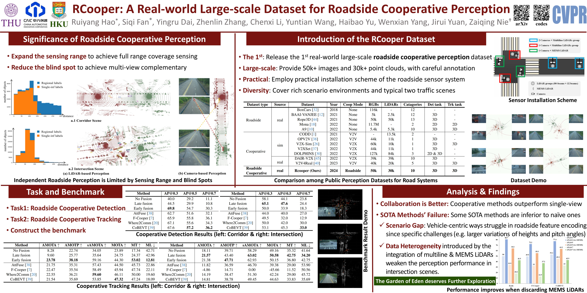

# RCooper: A Real-world Large-scale Dataset for Roadside Cooperative Perception

[](https://arxiv.org/abs/2403.10145)
[](https://drive.google.com/drive/folders/1J2nhh41UYp5jugdMT7zpxKr0CRoqpRUJ?usp=drive_link)

This is the official implementation of CVPR2024 paper. "RCooper: A Real-world Large-scale Dataset for Roadside Cooperative Perception".
[Ruiyang Hao<sup>*</sup>](https://ry-hao.top/),  [Siqi Fan<sup>*</sup>](https://leofansq.github.io/), [Yingru Dai](https://dblp.org/pid/350/9258.html), [Zhenlin Zhang](https://www.linkedin.com/in/zhenlinzhangtim/), [Chenxi Li](),  [Yuntian Wang](), [Haibao Yu](https://scholar.google.com/citations?user=JW4F5HoAAAAJ), [Wenxian Yang](https://scholar.google.com/citations?user=Kiz73xwAAAAJ), [Jirui Yuan](https://air.tsinghua.edu.cn/en/info/1012/1219.htm), [Zaiqing Nie<sup>†</sup>](https://scholar.google.com/citations?user=Qg7T6vUAAAAJ)

<div style="text-align:center">

</div>

## Overview
- [Data Download](#data-download)
- [Devkit Setup](#devkit-setup)
- [Quick Start](#quick-start)
- [Benchmark](#benchmark)
- [Citation](#citation)
- [Acknowledgment](#known-issues)

## Data Download
Please check the bottom of this page [website](https://www.t3caic.com/qingzhen/) to download the data. As shown in the figure bellow.

<div style="text-align:center">

</div>

After downloading the data, please put the data in the following structure:
```shell
├── RCooper
│   ├── calib
|      |── lidar2cam
|      |── lidar2world
│   ├── data
|      |── folders named specific scene index
│   ├── labels
|      |── folders named specific scene index
│   ├── original_label
|      |── folders named specific scene index
```

## Quick Start

For detection training & inference, you can find instructions in [docs/corridor_scene](docs/corridor_scene) or [docs/intersection_scene](docs/intersection_scene) in detail.

Notes: you may need to set PYTHONPATH to call modified codes other than the pip installed ones.

For Tracking, you can find instructions in [docs/tracking.md](docs/tracking.md) in detail.

All the checkpoints are released in link in the tabels below, you can save them in [codes/ckpts/](codes/ckpts/).

## Benchmark
### Results of Cooperative 3D object detection for corridor scenes
| Method                                         | AP@0.3   | AP@0.5   | AP@0.7   | Download Link                                                                                  |
| ---------------------------------------------- | -------- | -------- | -------- | ---------------------------------------------------------------------------------------------- |
| No Fusion                                      | 40.0     | 29.2     | 11.1     | [url](https://drive.google.com/drive/folders/1mmnIf0HDjS_vL1abptXM91pJHE3BLdqT?usp=drive_link) |
| Late Fusion                                    | 44.5     | 29.9     | 10.8     | [url](https://drive.google.com/drive/folders/1mKt7zKoS6KKzEqKWilHuQtpb36PSztxP?usp=drive_link) |
| Early Fusion                                   | **69.8** | 54.7     | 30.3     | [url](https://drive.google.com/drive/folders/1Ox0Vdh_LPShyK5uGX9s1FHI8USpITy_l?usp=drive_link) |
| [AttFuse](https://arxiv.org/abs/2109.07644)    | 62.7     | 51.6     | 32.1     | [url](https://drive.google.com/drive/folders/1uBTfVMWhbslPzF4f44q36pDHTwEPhoV_?usp=drive_link) |
| [F-Cooper](https://arxiv.org/abs/1909.06459)   | 65.9     | 55.8     | 36.1     | [url](https://drive.google.com/drive/folders/1k677v_DTHXf5lMC9DMBeOLHWdEtd3H-e?usp=drive_link) |
| [Where2Comm](https://arxiv.org/abs/2209.12836) | 67.1     | 55.6     | 34.3     | [url](https://drive.google.com/drive/folders/1aKj5A5wTuy2xJQSiErr0qJ6UWOKxJQFX?usp=drive_link) |
| [CoBEVT](https://arxiv.org/abs/2207.02202)     | 67.6     | **57.2** | **36.2** | [url](https://drive.google.com/drive/folders/1E8CBXLQmBVnShF2TeyTCkPJN_HBGSyzk?usp=drive_link) |

### Results of Cooperative 3D object detection for intersection scenes
| Method                                         | AP@0.3   | AP@0.5   | AP@0.7   | Download Link                                                                                  |
| ---------------------------------------------- | -------- | -------- | -------- | ---------------------------------------------------------------------------------------------- |
| No Fusion                                      | 58.1     | 44.1     | 23.8     | [url](https://drive.google.com/drive/folders/1MMYB9nSBcEprTOIyB3WkJ4nlnUpyEb05?usp=drive_link) |
| Late Fusion                                    | **65.1** | **47.6** | 24.4     | [url](https://drive.google.com/drive/folders/1MMYB9nSBcEprTOIyB3WkJ4nlnUpyEb05?usp=drive_link) |
| Early Fusion                                   | 50.0     | 33.9     | 18.3     | [url](https://drive.google.com/drive/folders/1u8g_f3vzqWqn_D4Sx_UdwX98Jm1wCul_?usp=drive_link) |
| [AttFuse](https://arxiv.org/abs/2109.07644)    | 45.5     | 40.9     | 27.9     | [url](https://drive.google.com/drive/folders/1W6PeNCnsnUMih1qZP3ONMtwcgDiXzciO?usp=drive_link) |
| [F-Cooper](https://arxiv.org/abs/1909.06459)   | 49.5     | 32.0     | 12.9     | [url](https://drive.google.com/drive/folders/1uO7MIHwjXA33CBv861l35IgAL_iMjAon?usp=drive_link) |
| [Where2Comm](https://arxiv.org/abs/2209.12836) | 50.5     | 42.2     | 29.9     | [url](https://drive.google.com/drive/folders/18kcO-G5JHLSj_pd6Gyj5zBYIUK4_fG8k?usp=drive_link) |
| [CoBEVT](https://arxiv.org/abs/2207.02202)     | 53.5     | 45.6     | **32.6** | [url](https://drive.google.com/drive/folders/1jA6Y0cqw4G-CNDCIUkl5QhNSt4axmVmC?usp=drive_link) |

### Results of Cooperative tracking for corridor scenes
| Method       | AMOTA(↑)  | AMOTP(↑)  | sAMOTA(↑) | MOTA(↑)   | MT(↑)     | ML(↓)     |
| ------------ | --------- | --------- | --------- | --------- | --------- | --------- |
| No Fusion    | 8.28      | 22.74     | 34.05     | 23.89     | 17.34     | 42.71     |
| Late Fusion  | 9.60      | 25.77     | 35.64     | 24.75     | 24.37     | 42.96     |
| Early Fusion | **23.78** | **38.18** | 59.16     | 44.30     | **53.02** | **12.81** |
| AttFuse      | 21.75     | 35.31     | 57.43     | 44.50     | 45.73     | 22.86     |
| F-Cooper     | 22.47     | 35.54     | 58.49     | 45.94     | 47.74     | 22.11     |
| Where2Comm   | 22.55     | 36.21     | **59.60** | 46.11     | 50.00     | 19.60     |
| CoBEVT       | 21.54     | 35.69     | 53.85     | **47.32** | 47.24     | 18.09     |

### Results of Cooperative tracking for corridor scenes
| Method       | AMOTA(↑)  | AMOTP(↑)  | sAMOTA(↑) | MOTA(↑)   | MT(↑)     | ML(↓)     |
| ------------ | --------- | --------- | --------- | --------- | --------- | --------- |
| No Fusion    | 18.11     | 39.71     | 58.29     | 49.16     | 35.32     | 41.64     |
| Late Fusion  | **21.57** | 43.40     | **63.02** | **50.58** | **42.75** | **34.20** |
| Early Fusion | 21.38     | **47.71** | 62.93     | 50.15     | 36.80     | 42.75     |
| AttFuse      | 11.84     | 36.63     | 46.92     | 39.32     | 29.00     | 53.90     |
| F-Cooper     | -4.86     | 14.71     | 0.00      | -45.66    | 11.52     | 50.56     |
| Where2Comm   | 14.21     | 38.48     | 50.97     | 42.27     | 29.00     | 45.72     |
| CoBEVT       | 14.82     | 38.71     | 49.04     | 44.67     | 33.83     | 35.69     |

## Citation
```shell
@article{hao2024rcooper,
  title={RCooper: A Real-world Large-scale Dataset for Roadside Cooperative Perception},
  author={Hao, Ruiyang and Fan, Siqi and Dai, Yingru and Zhang, Zhenlin and Li, Chenxi and Wang, Yuntian and Yu, Haibao and Yang, Wenxian and Jirui, Yuan and Nie, Zaiqing},
  journal={arXiv preprint arXiv:2403.10145},
  year={2024}
}
```

## Acknowledgment
- [V2V4Real](https://github.com/ucla-mobility/V2V4Real)
- [OpenCOOD](https://github.com/DerrickXuNu/OpenCOOD)
- [AB3DMOT](https://github.com/xinshuoweng/AB3DMOT)
- [DAIR-V2X](https://github.com/AIR-THU/DAIR-V2X)

Sincere appreciation for their great contributions.